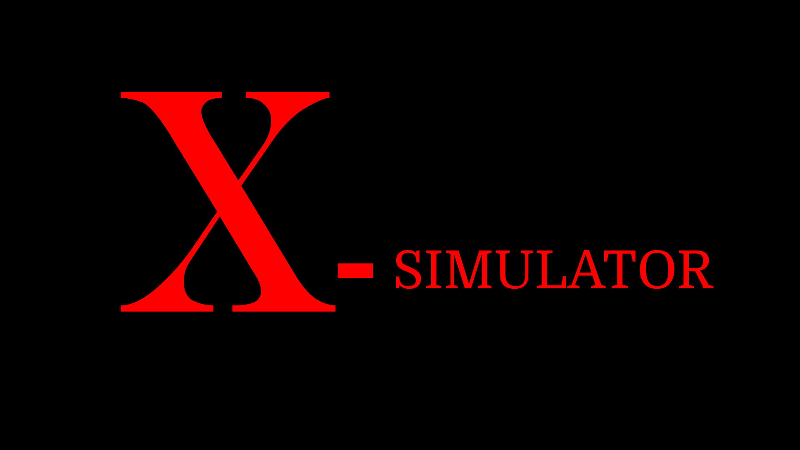

# **Project Name: Self-driving Car Simulator**

## **Purpose**:
   The purpose of this project is creating a simulator framework to help testing autopilot software

## **Concepts**:
   This simulator is going to simulate real world traffic scenarios with trained nuronal networks. There are going to have **front end GUI** (build by Unity3D), **back end controller** (test autopilot software). Detail design please check [Simulator Design Concept](#Simulator-Design-Concepts)

## **Simulate Scenarios**:
   ### 1. Parking:
   * **1-1.** System will generate a random parking map, holes, vechicles, and pedestrians by the Parking Simulator Nuronal Network:
     * **PASS** standard:
       * Not hitting vechicles
       * Not hitting pedestrians
       * Not hitting walls
       * Not dropping to holes
       * Successfully detected available parking space
       * Successfully parking to empty space

## **Simulator Design Concepts**:
   ### Data Design Concepts:
   * **Map Data**: Maps data would be a 2D array contains an enviourment object in each cell, such as "t" stands as tree, "b" stands as build, and each object contains hight, width and angle and some other features, just the same as HD detail maps. **Test object 1**:Autoplot software should be able to locate it self as the right location. 
   * **Training Data**: Training data would be a 2D array corresponding to 2D map array, and each cell contains a behaviour object, such as "move forward", "move backward", "turn num degrees", each behavior object contains degrees, speed, etc attributs. **Test object 2**:With corresponding location, will the car act proper behavior?
   
   ### Parking Simulator Neural Network:
   * **Component**:
     * **Map Generator**: fectch pre-build maps from database, and created maps can be uploaded/downloaded to/from database. Maps can be randomly picked by the Map Generator or be manually picked by tester.
     * **Vechicle Generator**: multiple Vechicles will be generated randomly with 2 types of states: **Parking** state and **Driving** state:
       * **Parking** state: Vechicles are pakring at parking lots properly (taken 1 space) or inproperly (taken 2 or more space)
       * **Driving** state: Simulating Vechicles driving with: 1 unified installed test autopilot software, 2 with different autopilot sofware installed (could be build-in autopilot software or third party autopilot software), will also randomly generate some cars that illegal driving to check if autopilot could deal with normal state and emergency state.
     * **Pedestrians Generator**: pedestrians will be generated with 3 state: **Stop**, **Legally Walking** and **Illegally Walking**:
       * **Stop**: Pedestrians idle on some random place.
       * **Legally Walking**: Pedestrains normally walking on parking lots.
       * **Illegally Walking**: Pedestrains walking on parking lots with some "unexpected" behaviors.
   * **Implementation**:
     * **Enviroment and Language**: 
      * **Default Autopilot Neural Network**: A default autopilot neural network is implemented using tensorflow (python) library.
      * **GUI**: Unity3D Web, takes inputs such as press gas with strength, turn left with degrees, turn right with degrees, and direction switch (go forwards: D or backwards: R)